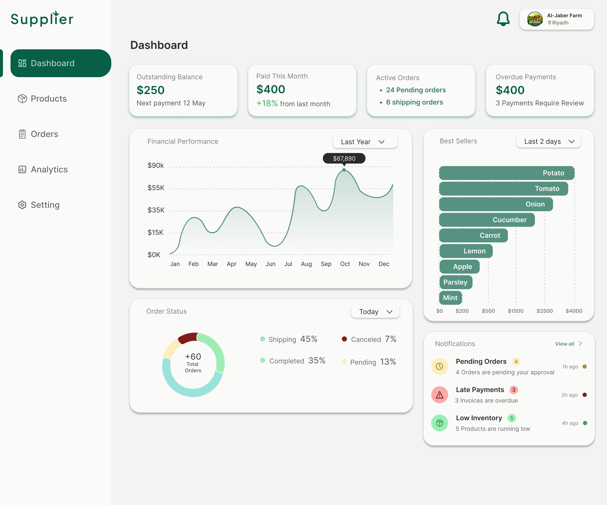
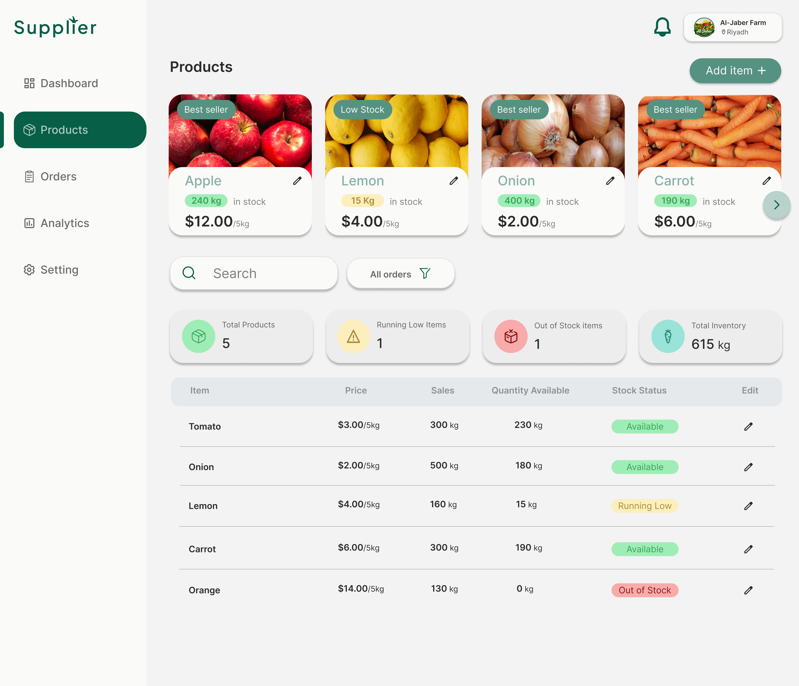

<div align="center">


# 🌿 Supplier — Farm-to-Restaurant Marketplace

**A modern B2B platform connecting local farmers with restaurants.**  
Farmers manage their produce through a professional dashboard. Restaurants discover, browse, and order fresh products — all in one place.

<br/>

[](https://react.dev/)
[](https://www.typescriptlang.org/)
[](https://tailwindcss.com/)
[](https://tanstack.com/query)
[](https://vitejs.dev/)
[](https://laravel.com/)
[](https://www.postgresql.org/)
[]()
[](./LICENSE)

<br/>

</div>

---

## 📸 Screenshots

<table>
  <tr>
    <td align="center"><b>🏠 Landing Page</b></td>
    <td align="center"><b>📊 Farmer Dashboard</b></td>
  </tr>
  <tr>
    <td></td>
    <td></td>
  </tr>
  <tr>
    <td align="center"><b>📦 Product Management</b></td>
    <td align="center"><b>🔐 Authentication</b></td>
  </tr>
  <tr>
    <td></td>
    <td></td>
  </tr>
</table>

---

## 📋 Table of Contents

- [Overview](#-overview)
- [Features](#-features)
- [Tech Stack](#-tech-stack)
- [Architecture](#-architecture)
- [Folder Structure](#-folder-structure)
- [API Integration](#-api-integration)
- [Dashboard Features](#-dashboard-features)
- [Responsive Design](#-responsive-design)
- [Performance](#-performance)
- [Roadmap](#-roadmap)
- [Why This Project Stands Out](#-why-this-project-stands-out)
- [License](#-license)
- [Contact](#-contact)

---

## 🌟 Overview

**Supplier** is a full-stack B2B marketplace that bridges the gap between local farmers and restaurants. The platform gives farmers a professional, data-rich dashboard to list products, track orders, and monitor financial performance — while restaurants can browse fresh produce by category and location.

> **Status:** ~80% complete. Core farmer functionality, authentication, and the landing page are fully implemented. Restaurant ordering flow and additional features are planned for the next phase.

### Key Highlights

| Area                | Details                                              |
| ------------------- | ---------------------------------------------------- |
| 🎯 **Target Users** | Farmers (Suppliers) & Restaurants (Buyers)           |
| 🔐 **Auth**         | Laravel Sanctum — token-based, persistent session    |
| 📊 **Analytics**    | Financial, order status, and best-seller charts      |
| 📦 **Products**     | Full CRUD with stock tracking and category filtering |
| 🌐 **API**          | Fully connected to a Laravel REST backend            |
| 📱 **Responsive**   | Mobile, tablet, and desktop layouts                  |

---

## ✅ Features

### 🟢 Implemented

<details>
<summary><b>🏠 Landing Page</b></summary>

- Responsive hero section with call-to-action buttons
- Product browsing with category and city filtering
- Best-sellers section with product cards
- Today's offers carousel
- Nearby suppliers section
- "How it works" steps section for restaurants and suppliers
- Footer with social links and payment method icons

</details>

<details>
<summary><b>🔐 Authentication</b></summary>

- Email/password login with Laravel Sanctum
- Multi-step farmer registration flow (Business Info → Documents → Address → Bank Details)
- Protected routes via React Router
- Persistent session using `localStorage`
- Auth context with a clean `useAuth` hook
- Account pending state page for new suppliers awaiting approval

</details>

<details>
<summary><b>📊 Farmer Dashboard — Overview</b></summary>

- Statistics cards: Outstanding Balance, Paid This Month, Active Orders, Overdue Payments
- **Financial Performance Chart** — area chart with period selector (Last Year / Last Month)
- **Order Status Chart** — donut chart showing Shipping / Completed / Pending / Cancelled breakdown
- **Best Sellers Chart** — horizontal bar chart with time-range filter (Today / Last 2 days / Week)
- Notifications panel (Pending Orders, Late Payments, Low Inventory)

</details>

<details>
<summary><b>📦 Product Management</b></summary>

- Product card grid with status badges (Best Seller, Low Stock, Out of Stock)
- Full CRUD: Add, Edit, Delete products
- Searchable and filterable product table
- Inventory summary: Total Products, Running Low, Out of Stock, Total Inventory (kg)
- Stock status indicators with color-coded labels

</details>

<details>
<summary><b>🔌 API Layer</b></summary>

- Configured Axios instance with base URL and `Content-Type` headers
- Automatic Bearer token injection via request interceptors
- TanStack Query for server-state management (caching, background refetch, loading/error states)
- Dedicated service files: `authService`, `ProductService`, `analytics`

</details>

<details>
<summary><b>✅ Form Validation</b></summary>

- React Hook Form for performant, uncontrolled form management
- Zod schema-based validation with clear error messages
- Validation schemas centralized in `schema.ts`

</details>

---

### 🟡 Planned (Roadmap)

See the [Roadmap](#-roadmap) section below.

---

## 🛠 Tech Stack

### Frontend

| Technology                                          | Version | Purpose                 |
| --------------------------------------------------- | ------- | ----------------------- |
| [React](https://react.dev/)                         | 19      | UI framework            |
| [TypeScript](https://www.typescriptlang.org/)       | ~6      | Type safety             |
| [Tailwind CSS](https://tailwindcss.com/)            | 4       | Utility-first styling   |
| [Vite](https://vitejs.dev/)                         | 8       | Build tool & dev server |
| [React Router](https://reactrouter.com/)            | 7       | Client-side routing     |
| [TanStack Query](https://tanstack.com/query/latest) | 5       | Server state management |
| [Axios](https://axios-http.com/)                    | 1.x     | HTTP client             |
| [React Hook Form](https://react-hook-form.com/)     | 7       | Form management         |
| [Zod](https://zod.dev/)                             | 4       | Schema validation       |
| [Recharts](https://recharts.org/)                   | 3       | Data visualization      |
| [Swiper](https://swiperjs.com/)                     | 12      | Touch carousel          |
| [Lucide React](https://lucide.dev/)                 | latest  | Icon library            |
| [i18next](https://www.i18next.com/)                 | 26      | Internationalization    |

### Backend (External API)

| Technology                                          | Purpose                    |
| --------------------------------------------------- | -------------------------- |
| [Laravel](https://laravel.com/)                     | REST API backend           |
| [Laravel Sanctum](https://laravel.com/docs/sanctum) | Token-based authentication |
| [PostgreSQL](https://www.postgresql.org/)           | Relational database        |

---

## 🏗 Architecture

```
┌─────────────────────────────────────────────────────┐
│                    React 19 SPA                     │
│  ┌───────────┐  ┌──────────────┐  ┌──────────────┐  │
│  │  Routing  │  │  Auth Layer  │  │  UI Library  │  │
│  │  (React   │  │  (Context +  │  │  (Tailwind + │  │
│  │  Router)  │  │   Sanctum)   │  │   Recharts)  │  │
│  └───────────┘  └──────────────┘  └──────────────┘  │
│  ┌─────────────────────────────────────────────────┐ │
│  │           Server State (TanStack Query)          │ │
│  │   Caching · Background Refetch · Error States   │ │
│  └─────────────────────────────────────────────────┘ │
│  ┌─────────────────────────────────────────────────┐ │
│  │              API Layer (Axios)                  │ │
│  │   Interceptors · Token Injection · Base URL     │ │
│  └─────────────────────────────────────────────────┘ │
└───────────────────────┬─────────────────────────────┘
                        │ HTTP / REST
┌───────────────────────▼─────────────────────────────┐
│              Laravel REST API Backend                │
│   Sanctum Auth · PostgreSQL · Business Logic        │
└─────────────────────────────────────────────────────┘
```

### Design Principles

- **Feature-based folder structure** — code grouped by domain, not by file type
- **Component-based UI** — small, reusable, single-responsibility components
- **Separation of concerns** — services handle API calls, hooks handle state, components handle rendering
- **Type safety** — strict TypeScript types across the entire codebase
- **Centralized validation** — all Zod schemas live in `schema.ts`

---

## 📁 Folder Structure

```
src/
├── assets/                  # Static assets (SVGs, images, screenshots)
│   ├── screenshoots/        # UI screenshots
│   ├── dashboard/           # Dashboard-specific icons
│   └── *.svg                # Brand and feature icons
│
├── components/              # Reusable UI components
│   ├── dashboard/           # Dashboard-specific components
│   │   ├── charts/          # Recharts chart components
│   │   │   ├── BestSellerChart.tsx
│   │   │   ├── FinancialPerformanceChart.tsx
│   │   │   └── OrderStatusChart.tsx
│   │   ├── Header.tsx
│   │   ├── SideBar.tsx
│   │   ├── StatisticCard.tsx
│   │   ├── ProductCard.tsx
│   │   └── TableCard.tsx
│   ├── auth/                # Auth-related components
│   ├── forms/               # Reusable form components
│   └── *.tsx                # Landing page components
│
├── contexts/                # React Context providers
│   ├── AuthContext.ts        # Auth context definition
│   ├── AuthProvider.tsx      # Auth state & token management
│   ├── useAuth.ts            # Auth hook
│   └── FarmerSignupProvider.tsx  # Multi-step signup state
│
├── hooks/                   # Custom TanStack Query hooks
│   ├── useBestSellers.ts
│   ├── useFinancialPerformance.ts
│   ├── useOrderStatus.ts
│   ├── useProducts.ts
│   └── useProductState.ts
│
├── layouts/                 # Page layout wrappers
│   ├── DashboardLayout.tsx
│   └── SupplierRegistrationLayout.tsx
│
├── pages/                   # Route-level page components
│   ├── Home.tsx
│   ├── auth/                # Login, Signup, multi-step supplier pages
│   └── dashboard/
│       └── farmer/          # Overview, Products, Orders, Analytics
│
├── routes/
│   └── AppRoute.tsx         # Centralized route configuration
│
├── services/                # API service layer
│   ├── api.ts               # Axios instance with interceptors
│   ├── authService.ts
│   ├── ProductService.ts
│   └── analytics.ts
│
├── types/                   # Shared TypeScript types
│   ├── Product.ts
│   ├── User.ts
│   ├── Dashboard.ts
│   └── ...
│
├── ui/                      # Base UI primitives (design system)
│   ├── dashboard/           # Dashboard-specific primitives
│   │   ├── Table.tsx
│   │   ├── TableData.tsx
│   │   └── TableHeader.tsx
│   ├── Badge.tsx
│   ├── Button.tsx
│   ├── Card.tsx
│   ├── Chips.tsx
│   ├── Container.tsx
│   ├── Input.tsx
│   ├── Label.tsx
│   ├── ProgressBar.tsx
│   ├── SelectList.tsx
│   └── Swipper.tsx
│
├── schema.ts                # Centralized Zod validation schemas
└── main.tsx                 # App entry point
```

---

## 🔌 API Integration

The frontend communicates with a **Laravel REST API** via a configured Axios instance.

### Axios Instance

```typescript
// src/services/api.ts
const api = axios.create({
  baseURL: "http://127.0.0.1:8000/api",
  headers: { "Content-Type": "application/json" },
});

// Automatic Bearer token injection
api.interceptors.request.use((config) => {
  const auth = localStorage.getItem("suppliers.auth");
  if (auth) {
    const { token } = JSON.parse(auth);
    config.headers.Authorization = `Bearer ${token}`;
  }
  return config;
});
```

### TanStack Query Hooks

All API calls are wrapped in TanStack Query hooks for automatic caching and background sync:

```typescript
// src/hooks/useProducts.ts
export const useProducts = () =>
  useQuery({ queryKey: ["products"], queryFn: fetchProducts });

// src/hooks/useBestSellers.ts
export const useBestSellers = (range: string) =>
  useQuery({
    queryKey: ["bestSellers", range],
    queryFn: () => fetchBestSellers(range),
  });
```

### Endpoints Used

| Method   | Endpoint                  | Description                      |
| -------- | ------------------------- | -------------------------------- |
| `POST`   | `/login`                  | Farmer/Restaurant authentication |
| `POST`   | `/signup`                 | User registration                |
| `GET`    | `/products`               | Fetch farmer's product list      |
| `POST`   | `/products`               | Create a new product             |
| `PUT`    | `/products/{id}`          | Update product details           |
| `DELETE` | `/products/{id}`          | Delete a product                 |
| `GET`    | `/analytics/best-sellers` | Best-selling products            |
| `GET`    | `/analytics/financial`    | Financial performance data       |
| `GET`    | `/analytics/order-status` | Order breakdown by status        |

---

## 📊 Dashboard Features

The farmer dashboard is the core of the platform, providing real-time business insights.

### Overview Page

| Widget                   | Description                                           |
| ------------------------ | ----------------------------------------------------- |
| 💰 Outstanding Balance   | Current unpaid balance owed to the farmer             |
| 📅 Paid This Month       | Revenue received this month with % change indicator   |
| 📦 Active Orders         | Count of pending and in-transit orders                |
| ⚠️ Overdue Payments      | Payments flagged as requiring review                  |
| 📈 Financial Performance | Area chart with monthly/yearly revenue breakdown      |
| 🍩 Order Status          | Donut chart — Shipping, Completed, Pending, Cancelled |
| 🏆 Best Sellers          | Horizontal bar chart of top-performing products       |

### Products Page

| Feature         | Description                                                     |
| --------------- | --------------------------------------------------------------- |
| Product Grid    | Visual card layout with status badges                           |
| Inventory Table | Sortable table with price, sales, stock, and status             |
| Stock Badges    | Color-coded: `Available` / `Running Low` / `Out of Stock`       |
| Search & Filter | Real-time search + filter by order status                       |
| Add Product     | Modal/form with full validation                                 |
| Edit Product    | Inline edit flow                                                |
| Summary Cards   | Total Products, Running Low count, Out of Stock count, Total kg |

---

## 📱 Responsive Design

The entire application is built mobile-first with Tailwind CSS v4.

| Breakpoint              | Layout                                                         |
| ----------------------- | -------------------------------------------------------------- |
| `< 768px` (Mobile)      | Single-column layout, collapsible sidebar, stacked cards       |
| `768px–1024px` (Tablet) | 2-column grids, condensed navigation                           |
| `> 1024px` (Desktop)    | Full dashboard layout, 4-column stat cards, multi-panel charts |

The dashboard grid uses responsive Tailwind classes like `grid-cols-1 md:grid-cols-2 lg:grid-cols-3 xl:grid-cols-4` to adapt fluidly across all screen sizes.

---

## ⚡ Performance

| Technique              | Implementation                                                                    |
| ---------------------- | --------------------------------------------------------------------------------- |
| **Query Caching**      | TanStack Query caches all API responses, preventing redundant network calls       |
| **Code Splitting**     | Vite automatically splits routes into lazy-loaded chunks                          |
| **Optimistic UI**      | Loading and error states handled per-query for immediate feedback                 |
| **Uncontrolled Forms** | React Hook Form avoids re-renders on every keystroke                              |
| **SVG Assets**         | Illustrations and icons use SVG for resolution-independent, lightweight rendering |

---

## 🗺 Roadmap

The following features are planned for future development phases:

| Feature                                   | Phase   | Priority  |
| ----------------------------------------- | ------- | --------- |
| 🛒 Restaurant ordering flow               | Phase 2 | 🔴 High   |
| ❤️ Favorites (restaurants save products)  | Phase 2 | 🟡 Medium |
| 🔔 In-app notifications                   | Phase 2 | 🟡 Medium |
| 🤖 AI-powered analytics for farmers       | Phase 3 | 🟢 Low    |
| 🚚 Delivery scheduling system             | Phase 3 | 🟡 Medium |
| 💳 Payment integration (Stripe / Moyasar) | Phase 3 | 🔴 High   |
| 🌍 Full i18n (Arabic / English)           | Phase 3 | 🟡 Medium |
| ⭐ Ratings & reviews                      | Phase 4 | 🟢 Low    |

---

## 💡 Why This Project Stands Out

### Clean Code Practices

- **Strict TypeScript** — every component prop, API response, and form shape is typed
- **Feature cohesion** — hooks, services, types, and pages are organized by domain
- **Single-responsibility components** — each component does one thing well
- **Centralized Zod schemas** — validation logic lives in one place and is shared across forms

### Real-world Architecture Decisions

- **TanStack Query over `useEffect`** — server state is fully managed with automatic background sync, stale-while-revalidate, and cache invalidation
- **Axios interceptors** — token injection is handled globally, keeping service files clean
- **Context + custom hooks** — `useAuth()` and `useFarmerSignup()` provide a clean API to consumers without exposing provider internals
- **Multi-step registration flow** — farmer signup uses a dedicated context (`FarmerSignupProvider`) to manage cross-step form state without prop drilling

---

## 📄 License

This project is licensed under the **MIT License**. See the [LICENSE](./LICENSE) file for details.

---

## 📬 Contact

<div align="center">

**Rawaa Baessa**

[](https://github.com/rawaabaessa)

</div>

---

<div align="center">

Made with 🌿 and clean code.

</div>
